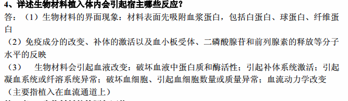
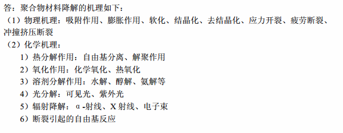

1. 什么是生物材料？生物材料必须满足哪些基本要求？

   1. 用于与生物系统相互接触后可以对其组织、器官或功能进行诊断、治疗、增强或替换的(一类天然或人工合成的特殊功能)材料。  

   2. 生物相容性、化学稳定性、力学条件、其他要求

      ​

2. 生物医用材料有哪些类型，描述其具体分类？

   1. 天然生物材料，这是一类在生物过程中形成的材料，如棉、麻、蚕丝、贝壳等；

   2. 生物医用材料，指植入活体内能有某种生物学功能的材料，如制作各种人工器官的材料；

   3. 仿生和组织工程材料，它是生物材料学与化学、工程学交叉的部分，包括各种仿生材料、智能材料和组织工程材料。

      ​

3. 生物矿化的定义及主要分类是什么？

   1. 是在一定条件下，在生物体的不同部位，以各种作用方式，在有机基质和细胞的参与下，无机元素从环境中选择性的在特定的有机基质上形核、生长和相变而转变为结构高度有序的生物矿物的过程。

4. 表面改性的主要方法有哪些？主要表征方法有哪些？

   1. 主要方法：等离子体表面改性；离子注入表面改性；离子束辅助沉积；LB技术：硅烷化；自组装单层膜；钝化处理；激光涂覆
   2. 表征方法：微量元素分析法，微观观察法：透射电镜， 扫描电镜 ，立体显微镜 ，图像分析仪

   ​

5. 生物材料的生物相容性的含义?

      材料、假体、人工器官或者医用装置在体内某种应用过程中与适当的宿主所发生的反应。

6. 植入生物材料中哪些因素会导致凝血系统异常？目前有哪些改进方法？

      

7. 详述生物材料植入体内会引起宿主哪些反应？

      

8. 造成聚合物材料降解的主要原因有哪些？

      

9. 金属材料的晶格结构？

      金属晶体的结合键是金属键。由于金属键具有无饱和性和无方向性的特点。从而使金属内部的原子趋于紧密排列，构成高度对称性的简单晶体结构。

      1. 体心立方晶格bcc

      2. 面心立方晶格fcc

      3. 密排六方晶格hcp

         ​

10. 以骨和血液接触材料为例说明材料表面形貌与生物相容性的关系。

      1. 骨接触材料：生物惰性材料植入骨内后，材料与骨组织的接触界面有薄层纤维组织形成，有时还会有不同程度的钙盐沉积，该界面属于不稳定状态，随着时间的延长纤维层逐渐变薄或消失，但在界面处无新生骨细胞生长，骨形成缓慢，是一种有效的界面结合形式。

      2. 血液接触材料：

         1. 含水结构：含水或亲水性材料表面具有较好的抗凝血性能。

         2. 带负电的红白细胞、血小板在带有适当负电荷的材料表面上，粘附较为困难，但是容易粘附在表面带有正电荷的材料上，进而继发凝血与血栓形成。

         3. 表面张力：指物质表面层微粒间存在的一种平行于表平面的力。它导致液体表面的紧缩，从而维持了最小表面积的一定界面，即表面张力的大小反
            映了表面自动收缩趋势的大小。

            ​

11. 简述提高生物材料血液相容性的表面修饰方法。

       1. 等离子体表面处理 ：等离子体表面处理会使高分子材料表面产生刻蚀和粗糙化，由于荷能离子撞击材料表面引起刻蚀，而材料的晶体部分的刻蚀率不同，因此在材料表面会形成微细的凹凸形，射出来的物质在等离子体场中受到激励，又会向表面逆向扩散，重新聚集在凸形顶端，结果形成大量突出物。*对改性材料的蛋白质吸附试验表明，材料表面的血浆蛋白吸附量大幅减少，表明血液相容性提高。*

       2. 材料与血液接触时首先是材料表面吸附血浆蛋白。蛋白质吸附层的组成与构象决定了材料的血液相容性行为。

          用白蛋白涂层或改善材料的表面结构的方法，使材料选择性地吸附白蛋白涂层来提高材料的血液相容性，

12. 金属的毒性主要由哪些原因引起？如何作用？可通过哪些方法检测

       1. 毒性反应与材料释放的化学物质和浓度有关。纯金属的毒性与它在元素周期表的位置有关。如：ⅡB族锌(Zn)、镉(Cd)、汞(Hg)毒性强；|第ⅢA族的铝(Al)、镓(Ga)、铟(In)无毒；
       2. 金属的毒性主要作用于细胞，可抑制酶的活动，阻止酶通过细胞膜扩散和破坏溶酶体。
       3. 利用**测定**乳酸脱氢酶(**LDH**)和6~磷酸葡萄糖脱氢酶(**G~6~PD**)**活性法**检测植入金属对鼠类吞噬细胞的影响，可以**表明**：**有毒金属如钴镍和钴铬合金能损伤细胞，释放 LDH，降低G~6~PD的活性**，但钛、铬、钼则能为吞噬细胞所耐受。某些金属成分还可以引起过敏反应。

       ​

13. 什么是生物相容性，生物相容性包括哪些方面？组织相容性指的是什么？

       1. 材料、假体、人工器官或者医用装置在体内某种应用过程中与适当的宿主所发生的反应。
       2. 包括
          1. 血液相容性：材料直接接触血液用于心血管系统，主要应考察材料与血液的相互作用
          2. 组织相容性：主要考察用于心血管系统之外与肌肉、骨骼、皮肤等组织直接接触的材料的相容性
          3. 免疫相容性：长期植入人体的材料必须关注材料的抗原性或免疫学性能。

14. 什么是生物矿化的三原则？

       - 生物矿化发生于特定的亚单元隔室或微环境中，晶体只能在特定的功能位点上成核、长大；隔室尺度由细胞分泌的有机基质的空间分布决定，通常这些有机基质作为矿物生长的模板。
       - 特定的生物矿物具有确定的晶粒尺寸和晶体学取向，这是由有机基质的预构造及其化学性质决定。
       - 宏观上的生长是通过大量生长单元的组装堆砌而实现的。

15. 引起金属生物材料在体内腐蚀的主要原因是什么？

       人体体液约含有1%氯化钠及少量其它盐类和有机化合物，局部酸碱性经常略有变化，温度保持在37度左右，这种环境对金属材料会产生腐蚀，其腐蚀产物可能是离子，氧化物，氯化物等

       ​

16. 什么是宿主反应，生物材料植入生物体内引起的一系列宿主反应主要包括哪些？

       1. 即材料对活体系统的作用，包括局部和全身反应，如炎症、细胞毒性、凝血、过敏、致癌、畸形和免疫反应等，其结果可能导致对机体的中毒和机体对材料的排斥。
       2. 第7题

       ​

